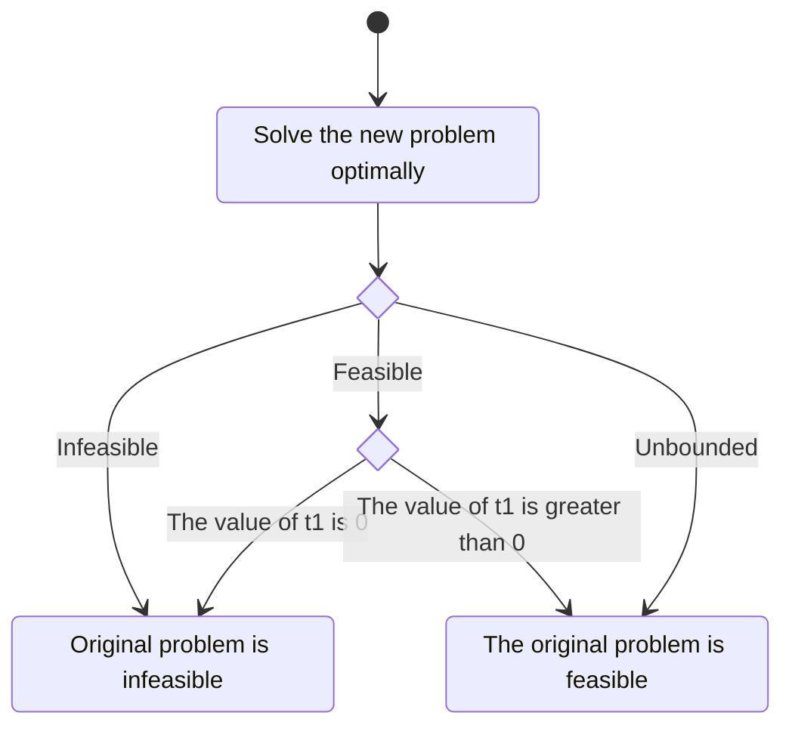

# Theory

Theory behind the solver.
While its knowledge is not necessary to use the solver, it can be useful to understand how it works, especially when debugging or extending its features.

## Satisfiability

First of all, it is necessary to introduce a few core concepts from propositional logic.
A propositional formula is a construct that uses _variables_ (or _unknowns_), which are assigned a semantic value **True** or **False**, and _logical connectives_, such as $\lor$ (or), $\land$ (and) and $\neg$ (not).
A literal is a variable or its negation.
A formula is in **NNF** if the negation operator $\neg$ is only applied to variables and not more extensive formulas.
The most used representation of a propositional formula is the **CNF**, a conjunction of clauses, where a clause is a disjunction of literals.

Solving a **SAT** problem means determining whether assigning values to the variables that make the formula true is possible or proving that such an assignment does not exist.
A **SAT** solver is a tool that takes as input a propositional formula and returns **sat** with a valid assignment if the input was satisfiable, or **unsat** with an unsatisfiable subset of conjunctions otherwise.

When in **CNF**, a clause is satisfied if at least one of its variables is assigned the value **true**.
On the other hand, a clause is unsatisfied if all of the variables are assigned the value **false**.
Furthermore, a clause is unit if it contains a single unassigned variable, while all the others are **false**.
A formula is satisfied if all its clauses are satisfied and unsatisfied if at least one clause is unsatisfied.

### CNF encoding

To be tackled efficiently by modern solvers, formulas are often transformed in their **CNF**.
In a formal notation, **CNF** formulas can be defined as follows:

$$
\begin{array}{}
    \bigwedge_{i=1}^n \bigvee_{j=1}^{m_i} l_{ij} \newline
    ( l_{00} \lor l_{01} \lor \dots \lor l_{0m_0}) \land (l_{10} \lor l_{11} \lor \dots \lor l_{1m_1}) \land \dots \land (l_{n0} \lor l_{n1} \lor \dots \lor l_{nm_n}) \newline
    \text{Set notation} \newline
    \langle \langle l_{00}, l_{01} , \dots , l_{0m_0} \rangle , \langle l_{10} , l_{11} , \dots , l_{1m_1} \rangle, \dots , \langle l_{n0} , l_{n1} , \dots , l_{nm_n} \rangle \rangle
\end{array}
$$

A naive approach to obtain such a form would be to use _De Morgan's laws_ and the distributive property.
This, unfortunately, would lead to an exponential blowup in the size of the formula.
Hence, the Tseitin transformation is usually utilized [^paper:tseitin].
It introduces a linear number of new variables, one for each subformula of the original, along with the clauses that define the relationship between the new variables and the subformulae.
The fundamental property is that the new formula is satisfiable if and only if the original one is.

The transformation uses three basic operators:

| Original    | $ p \iff \text{formula} $                             | In CNF                                                                    |
| ----------- | ----------------------------------------------------- | ------------------------------------------------------------------------- |
| $\neg a$    | $(\neg a \implies p) \land (p \implies \neg a)$       | $(a \lor p) \land (\neg a \lor \neg p)$                                   |
| $a \land b$ | $(a \land b \implies p) \land (p \implies a \land b)$ | $(\neg a \lor \neg b \lor p) \land (a \lor \neg p) \land (b \lor \neg p)$ |
| $a \lor b$  | $(a \lor b \implies p) \land (p \implies a \lor b)$   | $(a \lor b \lor \neg p) \land (\neg a \lor p) \land (\neg b \lor p)$      |

$$
\begin{array}{}
\text{Example} \newline
\text{Original formula} \newline
\underbrace{\underbrace{(a \land \neg b)}*{p_1} \lor \neg \underbrace{(c \land d)}*{p*2}}*{p*3} \newline
\newline
\text{New variables} \newline
p_1 \iff a \land \neg b \newline
p_2 \iff c \land d \newline
p_3 \iff p_1 \lor \neg p_2 \newline
\newline
\text{CNF formula} \newline
\underbrace{(\neg a \lor b \lor p_1) \land (a \lor \neg p_1) \land (\neg b \lor \neg p_1)}*{p*1} \land \underbrace{(\neg c \lor \neg d \lor p_2) \land (c \lor \neg p_2) \land (d \lor \neg p_2)}*{p*2} \land \underbrace{(p_1 \lor \neg p_2)}_{p_3}
\end{array}
$$

### SAT algorithms

Solving a **SAT** problem is no easy task.
Since the number of possible assignments is finite, a naive approach would be to loop over them and verify if they satisfy the formula.
This technique called _Local search_, has seen some use when combined with specialised heuristics to guide the next assignment to try.
Regardless, proving that a formula is unsatisfiable would require evaluating all possibilities, which is infeasible for large formulas.

Complete algorithms, on the other hand, are guaranteed to find a solution if one exists and to prove that no solution exists otherwise.
Properties of **SAT** problems can be exploited to produce different solving techniques.

For example, the **DP** algorithm is based on the _resolution_ inference rule.
The latter states that if a formula $F$ contains clauses $C_i$ and $C_j$ and a variable $P$ such that $P \in C_i$ and $\neg P \in C_j$, then $F' = F \setminus \{ C_i, C_j \} \cup \{(C_i \setminus \{ P \}) \cup (C_j \setminus \{\neg p\})\}$ is equisatisfiable with $F$.
By iterating the resolution rule, it is possible to simplify the formula until it is either empty (SAT) or contains an empty clause (UNSAT).

A typical implementation of the **DP** algorithm defines an order on the variables and puts all clauses on a bucket corresponding to the smallest variable they contain.
Then, each bucket is processed in order, and the resolution rule is applied to all pairs of clauses in the bucket.
The resolvents are then put in the bucket corresponding to the smallest variable they contain.
The process halts when the empty clause is found, or all buckets are empty.

### DPLL

One of the most widely used algorithms to solve **SAT** problems in **CNF** is the **DPLL** algorithm [^paper:dpll].
During its execution, the state of the solver keeps track of a partial assignment $M$ over the formula $F$.
In practice, $M$ is a set of literal, either $l$ or $\neg l$, where $l$ is a variable.
The literal can also be marked as a decision literal $l^d$.
In addition, if a literal is in $M$, its negation must not: $l \in M \implies \neg l \not\in M$.
Given the state $M \parallel F$, a clause $C$ conflicts if $M \models \neg C$.

Each state of the algorithm can transition to the next by following a _transition rule_.
If the transition system $R$ does not admit any transition from the current state $S$, then $S$ is final with respect to $R$.
The classical **DPLL** algorithm uses the following transition rules:

- **Unit propagate**: $M \parallel F, C \lor l \implies M l \parallel F, C \lor l \quad \text{if} \begin{cases} M \models \neg C \\ l \not \in M \end{cases}$
  If a clause contains a single variable $l$ not yet in $M$ and all others marked as _false_, $M$ must be extended to mark $l$ as _true_.
- **Pure literal**: $M \parallel F \implies M l \parallel F  \quad \text{if} \begin{cases} l \in F \\ \neg l \not \in F \\ l \not \in M \end{cases}$
  If a literal $l$ is pure, meaning it only occurs with the same polarity, it can be safely marked to make it _true_.
- **Decide**: $M \parallel F \implies M l^d \parallel F  \quad \text{if} \begin{cases} l \text{(or } \neg l \text{)} \in F \\ l \not \in M \end{cases}$
  A literal $l$ not yet in $M$ is chosen to be put in $M$ and is marked as a decision literal. If a contradiction is found later in the execution, the algorithm can backtrack to this decision and try the opposite value.
- **Fail**: $M \parallel F, C \implies \bot  \quad \text{if} \begin{cases} M \models \neg C \\ \not \exists l: l^d \in M \end{cases}$
  The formula is unsatisfiable if a conflicting clause is detected while no decision literals are in $M$.
- **Backtrack**: $M l^d N \parallel F, C \implies M \neg l \parallel F, C  \quad \text{if} \begin{cases} M l^d N \models \neg C \\ \not \exists l: l^d \in N \end{cases}$
  If a conflicting clause is detected while there are decision literals in $M$, the algorithm backtracks to the last decision literal, negates it and tries again. Note that the negation of a decision literal is not a decision literal.

Using the transition system described, it is possible to evaluate the satisfiability of a formula $F$ by starting from the state $\emptyset \parallel F$ and applying the transition rules until a final state is reached.

Most modern **DPLL**-based solvers do not implement the classical algorithm precisely as described [^paper:dpll(t)].
The variable to include in the **Decide** step is chosen with some specialised heuristics, and the **Backtrack** becomes a particular case of the more efficient **Backjump** rule.
Those are just a few examples of the many optimizations that can be applied to the **DPLL** algorithm.
Unfortunately, **SAT** remains an NP-complete problem, meaning that all known algorithms to solve it are exponential in the worst case, although it usually performs much better in practice.

### Applications

Satisfiability problems arise in many different fields.
**SAT** solvers find their applications in computationally demanding problems, such as travelling salesman, planning, scheduling, and many others.
They are also a key component in formal methods, such as model checking and automated theorem proving, by verifying a property in a system.
Hence, they are often employed in software verification, where the system is a program, and the property is a specification of its behaviour.
This becomes even more important in safety-critical systems like medical devices, autonomous vehicles, or cryptographic systems.

## SMT

**SMT** is a family of decision problems in propositional logic.
Instead of considering all possible interpretations that could be applied to a formula, it restricts the possible arrangements to only those that respect a given theory.

The theories we are interested in are **QF-LRA** and **QF-LIA**.
The former describes quantifier-free linear real arithmetic, while the latter describes quantifier-free linear integer arithmetic.

### SMT approaches

A general **SAT** solver could, in principle, solve any **SMT** problem, provided it was given all the axioms of the theory as input, but it could be highly inefficient.
There are two main approaches to solving **SMT** problems.

The _eager_ approach traduces the problem into a **SAT** problem by translating the formula into an equisatisfiable propositional formula.
Such a translated formula can be fed to any efficient **SAT** solver.
Although always possible in principle, it may sometimes lead to an exponential blowup in the size of the formula.
An example of an eager **SMT** solver is STP [^repo:stp].

Instead, the _lazy_ approach embraces the theory fully and implements a specialised inference system for it.
It is possible to use specific algorithms and data structures at the cost of a less general solver, which could lead to better performance.
An example of a **SMT** solver that supports the lazy approach is Z3 [^repo:z3].

### DPLL(T)

Given a theory $\mathcal{T}$, a theory solver, or T-solver, is a tool that can decide whether a set of assertions over $\mathcal{T}$ is satisfiable.
If those atoms are combined in a boolean formula $F$, their satisfiability can be evaluated by a **SAT** solver.
The **DPLL**(T) approach represents an efficient method for integrating a theory solver and the **DPLL** procedure. [^paper:dpll-t].
The T-solver's job is to keep track of the theory atoms and their consistency with any new inclusion.
It could also identify and include atoms implied by the current state, with a technique called _theory propagation_.

Given a formula $F$, we denote with $\mathcal{A}$ the set of atoms in $F$ and with $\alpha$ the set of atoms currently asserted.
Similarly to the **DPLL** algorithm, the **DPLL**(T) algorithm maintains a stack of checkpoints used for backtracking when an inconsistency arises.
A simple API can be used to interact with the **DPLL** procedure:

- **Assert($\gamma$)**: tries to add $\gamma$ to $\alpha$. After checking for consistency, it returns either \texttt{OK} or \texttt{UNSAT}$\langle{\Gamma}\rangle$, where $\Gamma$ is a set of asserted atoms inconsistent with $\gamma$. The operation must be sound but not necessarily complete.
- **Check**: verifies whether $\alpha$ is consistent. It returns either \texttt{OK}, and a new checkpoint is created, or \texttt{UNSAT}$\langle{\Gamma}\rangle$, where $\Gamma \subseteq \alpha$ is a set of inconsistent atoms. The operation must be sound and complete.
- **Backtrack**: the state is restored to the last checkpoint.
- **Propagate**: performs a theory propagation, by finding a set $\{\langle \Gamma_1, \gamma_1 \rangle, \dots, \langle \Gamma_t, \gamma_t \rangle\}$ where $\Gamma_i \subseteq \alpha$ and $\gamma_i \in \mathcal{A} \setminus \alpha$. The operation must be sound but not necessarily complete.

This generic approach can be applied to any theory by using a specialised T-solver for that theory.

### SMT2-LIB

APIs for **SMT** solvers are not standardized, though efforts have been made to provide a standard layer for several solvers that have been developed [^repo:java-smt].
In contrast, the SMT-LIB initiative, aimed at facilitating research and development in **SMT**, successfully created the de facto standard format used to represent **SMT** problems.
Nearly all modern **SMT** solvers support the SMT-LIB format, in addition to some more specific ones.

Example of an **SMT** problem in the SMT-LIB format:

```smt2
(set-logic QF_LRA) ; use the logic of linear real arithmetic
(declare-fun x () Real) ; real variable definition
(declare-fun y () Real)
(declare-fun z () Real)
(declare-fun u () Real)
(declare-fun v () Real)
(assert (and (or (<= (+ 3 x) (* 2 y)) (>= (+ 4 x) z))))
(check-sat) ; check if the formula is satisfiable
(get-model) ; print the model, if possible
```

This it the output of the problem above, obtained by using Z3:

```smt2
sat
(model
  (define-fun x () Real 0)
  (define-fun y () Real 3/2)
  (define-fun z () Real 0)
  (define-fun u () Real [ ENTIRE ])
  (define-fun v () Real 1)
)
```

## Linear Programming

A **LP** problem is an optimization problem where the objective function and the constraints are linear equalities or inequalities.
The objective function is what we want to maximize or minimize, while the constraints are the conditions the solution must satisfy.
The standard form of a **LP** problem is the following:

$$
\begin{equation*}
    \begin{aligned}
         & \text{maximize}   & c^T x      \newline
         & \text{subject to} & A x \leq b \newline
         &                   & x \geq 0
    \end{aligned}
\end{equation*}
$$

where $x \in \mathbb{R}^d$ is the vector of variables to be determined, $c \in \mathbb{R}^d$ and $b \in \mathbb{R}^n$ are vectors of coefficients, and $A \in \mathbb{R}^{n \times d}$ is a matrix of coefficients.
It is always possible to rewrite a **LP** problem in standard form following these steps:

\begin{itemize}

- If the problem is a minimization problem, it is sufficient to multiply the objective function by $-1$ to obtain the corresponding maximization problem.
- If some variables have no lower bound, they can be substituted with the difference of two variables, both with a lower bound of $0$ (i.e. $x = x_1 - x_2$ and $x_1, x_2 \geq 0$).
- If strict equalities exist, they can be substituted with two inequalities (i.e. $x = 0$ becomes $x \leq 0$ and $x \geq 0$).
- If there are some inequalities with different signs, one can be multiplied by $-1$ to ensure both have the same sign.
  \end{itemize}

**LP** problems are usually solved via the simplex method, although some interior-point methods [^paper:interior-point] may be used as well.
The simplex method is an iterative algorithm developed by George Dantzig in 1947 [^paper:simplex].
To apply the simplex method, the problem must be converted in _slack form_ to use the simplex method.
Starting with a **LP** problem in standard form, the slack form is obtained by introducing a slack variable for each constraint so that the inequality becomes an equality.
The slack variables must also be non-negative.

It is possible to extract an invertible squared matrix $B$ from $A$ of dimension $n \times n$ called basis.
The remaining columns of $A$ form the $N$ matrix.

$$
\begin{equation*}
    A = \begin{bmatrix}
        B & N
    \end{bmatrix}
    \text{, where }
    \begin{cases}
        B \in \mathbb{R}^{n \times n} \newline
        N \in \mathbb{R}^{n \times (d - n)}
    \end{cases}
\end{equation*}
$$

The variables $x_i$ corresponding to the columns of $B$ are called _basic variables_, while the ones that end up in $N$ _non-basic variables_.

With this framework, it is possible to define a tableau.
Each row of the tableau corresponds to a constraint.
An additional row called _objective row_, is added to represent the objective function associated with a special variable $z$.
All the original variables are considered _non-basic_, while the slack variables are _basic_.

$$
\begin{equation*}
    \begin{array}{c}
        \newline
        z   \newline
        s_1 \newline
        s_2 \newline
        s_3
    \end{array}
    \begin{bmatrix}
        \begin{array}{c|cccccc|c}
            z & x_1    & x_2    & x_3    & s_1 & s_2 & s_3 & b   \newline \hline
            1 & -c_1   & -c_2   & -c_3   & 0   & 0   & 0   & 0   \newline \hline
            0 & a_{11} & a_{12} & a_{13} & 1   & 0   & 0   & b_1 \newline
            0 & a_{21} & a_{22} & a_{23} & 0   & 1   & 0   & b_2 \newline
            0 & a_{31} & a_{23} & a_{33} & 0   & 0   & 1   & b_3 \newline
        \end{array}
    \end{bmatrix}
\end{equation*}
$$

To iterate the simplex method, the following steps are performed:

- Find the pivot column $j$, which is the column with the most negative coefficient in the objective row.
- Find the pivot row $i$, which is the row with the smallest ratio between the constant term $b_i$ and the coefficient of the pivot column.
- Divide the pivot row by the coefficient of the pivot column so that the value in position $(i, j)$ becomes $1$.
- All other rows must contain the value $0$ along the pivot column. This is achieved by subtracting the pivot row multiplied by the coefficient of the pivot column.
- The variable corresponding to the pivot column becomes basic, while the one corresponding to the pivot row on the left of the tableau becomes non-basic.
- Repeat until the objective row has no negative coefficients.

The solution is obtained by reading the corresponding value from the tableau's last column, while the objective function's value can be found in the top right corner.

## SMT and Linear Programming

Even when working within the same problem space, many differences exist between **LP** and **SMT** solvers.
**LP** solvers can only deal with conjunctions of constraints (i.e. all constraints must be satisfied) and focus on finding the optimal solution to the problem.
Some approximation errors are introduced when operating with floating point arithmetic.
But after years of research and interest in the subject, modern **LP** solvers have become highly efficient and reliable.
On the other hand, **SMT** solvers can deal with arbitrary boolean combinations of constraints and focus on finding an assignment that satisfies the formula without any guarantee of the solution's optimality.
There has been a lot of interest in incorporating **LP** solvers into a modern SMT solver [^paper:lp-for-smt].

In **QF-LRA**, the atoms of a formula propositional variables defined by equalities or inequalities in the form:

$$
\begin{equation*}
    a_1 x_1 + a_2 x_2 + \dots + a_n x_n \bowtie b
\end{equation*}
$$

where $a_1, a_2, \dots, a_n, x_1, x_2, \dots, x_n, b \in \mathbb{Q}$ and $\bowtie \in \{ =, \neq, \leq, \geq, <, > \}$.

Deciding the satisfiability of these components is usually done using a **LP** solver, which, in turn, usually relies on the simplex method.

### The problem of feasibility

Consider the following LP problem:

$$
\begin{array}{lll}
\max \quad & c_1 x_1 + c_2 x_2 + \dots + c_n x_n \newline
\text{s.t.} \quad & a_{11} x_1 + a_{12} x_2 + \dots + a_{1n} x_n \le b_1 \newline
& a_{21} x_1 + a_{22} x_2 + \dots + a_{2n} x_n \le b_2 \newline
& \vdots \newline
& a_{m1} x_1 + a_{m2} x_2 + \dots + a_{mn} x_n \le b_m \newline
& x_i \ge 0, \quad i = 1, 2, \dots, n
\end{array}
$$

with $c_i, a_{ij}, b_j \in \mathbb{R}$ and $i = 1, 2, \dots, n$, $j = 1, 2, \dots, m$.

<!-- New subsection -->

Since we are only interested in the feasibility of the problem, we can assume that the objective function is a constant, i.e., $0$.

$$
\begin{align*}
\max \quad & 0 \newline
\text{s.t.} \quad & a_{11} x_1 + a_{12} x_2 + \dots + a_{1n} x_n \le b_1 \newline
& a_{21} x_1 + a_{22} x_2 + \dots + a_{2n} x_n \le b_2 \newline
& \vdots \newline
& a_{m1} x_1 + a_{m2} x_2 + \dots + a_{mn} x_n \le b_m \newline
& x_i \ge 0, \quad i = 1, 2, \dots, n
\end{align*}
$$

Solving the problem with an LP solver will give us the feasibility of the problem.

<!-- New section -->

### Strict inequalities

Let's now consider the case where a strict inequality is present.

$$
\begin{align*}
\max \quad & 0 \newline
\text{s.t.} \quad & a_{11} x_1 + a_{12} x_2 + \dots + a_{1n} x_n < b_1 \newline
& \vdots \newline
& x_i \ge 0, \quad i = 1, 2, \dots, n
\end{align*}
$$

<!-- New subsection -->

#### How to deal with strict inequalities

Simplex based LP solvers have to either

- use a symbolic delta to the right-hand side of the inequality
  - requires a rational solver
- add a small real value $\epsilon$ to differentiate the left-hand side from the right-hand side of the inequality
  - adds an arbitrary error to the problem (what if $\epsilon$ is too small?)

<!-- New subsection -->

#### Alternative: Problem transformation

Maybe we could leverage the fact that we don't have an objective function and transform the problem in a way that allows us to check for feasibility on a problem with strict inequalities with a standard LP solver.

<div class="r-stack">

$$
\begin{array}{ll}
\max \quad & 0 \newline
\text{s.t.} \quad & a_{11} x_1 + a_{12} x_2 + \dots + a_{1n} x_n < b_1 \newline
& \vdots \newline
& x_i \ge 0, \quad i = 1, 2, \dots, n
\end{array}
$$

<!-- .element: class="fragment fade-in-then-out m-unset" -->

$$
\begin{align*}
\max \quad & 0 \newline
\text{s.t.} \quad & a_{11} x_1 + a_{12} x_2 + \dots + a_{1n} x_n + t_1 \le b_1 \newline
& \vdots \newline
& x_i \ge 0, \quad i = 1, 2, \dots, n \newline
& t_1 > 0
\end{align*}
$$

<!-- .element: class="fragment fade-in-then-out m-unset" -->

$$
\begin{align*}
\max \quad & t_1 \newline
\text{s.t.} \quad & a_{11} x_1 + a_{12} x_2 + \dots + a_{1n} x_n + t_1 \le b_1 \newline
& \vdots \newline
& x_i \ge 0, \quad i = 1, 2, \dots, n \newline
& t_1 \ge 0
\end{align*}
$$

<!-- .element: class="fragment fade-in-then-out m-unset" -->

</div>

<!-- New subsection -->

#### How to read the results

Since we are maximising $t_1$, if the problem is feasible, the solver will return a value of $t_1$ greater than $0$ if the problem allows it.



<!-- New subsection -->

#### Avoid unboundedness

Since to verify that a problem is unbounded can be tricky, we can add an arbitrary upper bound to the additional variable $t_1$.

$$
\begin{align*}
\max \quad & t_1 \newline
\text{s.t.} \quad & a_{11} x_1 + a_{12} x_2 + \dots + a_{1n} x_n + t_1 \le b_1 \newline
& \vdots \newline
& x_i \ge 0, \quad i = 1, 2, \dots, n \newline
& 0 \le t_1 \le 1
\end{align*}
$$

<!-- New subsection -->

#### Greater than inequalities

<div class="r-stack">

$$
\begin{align*}
\max \quad & 0 \newline
\text{s.t.} \quad & a_{11} x_1 + a_{12} x_2 + \dots + a_{1n} x_n > b_1 \newline
& \vdots \newline
& x_i \ge 0, \quad i = 1, 2, \dots, n \newline
\end{align*}
$$

<!-- .element: class="fragment fade-in-then-out m-unset" -->

$$
\begin{align*}
\max \quad & 0 \newline
\text{s.t.} \quad & -a_{11} x_1 - a_{12} x_2 - \dots - a_{1n} x_n < -b_1 \newline
& \vdots \newline
& x_i \ge 0, \quad i = 1, 2, \dots, n \newline
\end{align*}
$$

<!-- .element: class="fragment fade-in-then-out m-unset" -->

$$
\begin{align*}
\max \quad & t_1 \newline
\text{s.t.} \quad & -a_{11} x_1 - a_{12} x_2 - \dots - a_{1n} x_n + t_1 \le -b_1 \newline
& \vdots \newline
& x_i \ge 0, \quad i = 1, 2, \dots, n \newline
& t_1 \ge 0
\end{align*}
$$

<!-- .element: class="fragment fade-in-then-out m-unset" -->

</div>

<!-- New subsection -->

## Optimisation on not-equal constraints

Not equal constraints still represent the most expensive part of the solving process.
Each constraint is expanded into two inequalities, and the number of inequalities grows exponentially with the number of constraints.

Som heuristics can be used to optimise the process.

### Return as soon as one subproblem is solved

Since the problem is a disjunction of subproblems, if one subproblem is solved, the whole problem is solved.
Once it is found, all other subproblems can be discarded.

### If no non-equal constraint is violated and the problem is infeasible, return immediately

If no non-equal constraint is violated but the problem is not feasible, the issue is not with the non-equal constraints.
There is no point in enumerating all the other possibility.

### If a single non-equal constraint is violated, invert the sign of the constraint

If a single non-equal constraint is violated, changing the value of other not-equal constraints will not make the problem suddenly feasible.
We can prune the search space by inverting the sign of the constraint and solving the problem again.

Furthermore, if the problem is still infeasible under the same conditions, we can determine that the problem is unsatisfiable immediately.

### _If mutiple non-equal constraints are violated, try to find a subset of constraints that are violated (??)_

Some cases could be detected (and pruned) very easily without the need to invoke the solver

$$
\begin{align*}
\begin{cases}
x A_1 \ne b_1 \newline
x A_2 \ne b_2 \newline
x A_{3 \dots n} \le b_{3\dots n}
\end{cases}
\end{align*}
$$

This becomes

$$
\begin{cases}
x A_1 < b_1 \newline
x A_2 < b_2\newline
x A_{3 \dots n} \le b_{3\dots n}
\end{cases}
\
\lor
\
\begin{cases}
x A_1 > b_1 \newline
x A_2 < b_2 \newline
x A_{3 \dots n} \le b_{3\dots n}
\end{cases}
\
\lor
\
\begin{cases}
x A_1 < b_1 \newline
x A_2 > b_2 \newline
x A_{3 \dots n} \le b_{3\dots n}
\end{cases}
\
\lor
\
\begin{cases}
x A_1 > b_1 \newline
x A_2 > b_2 \newline
x A_{3 \dots n} \le b_{3\dots n}
\end{cases}
$$

How to find such cases?
What if we have more than two inequalities?

$$
\begin{cases}
x A_1 \ne b_1 \newline
x A_2 \ne b_2 \newline
x A_3 \ne b_3 \newline
x A_{3 \dots n} \le b_{3\dots n}
\end{cases}
$$

This becomes

$$
\begin{cases}
x A_1 < b_1 \newline
x A_2 < b_2 \newline
x A_3 < b_3 \newline
x A_{3 \dots n} \le b_{3\dots n}
\end{cases}
\
\lor
\
\begin{cases}
x A_1 > b_1 \newline
x A_2 < b_2 \newline
x A_3 < b_3 \newline
x A_{3 \dots n} \le b_{3\dots n}
\end{cases}
\
\lor
\
\begin{cases}
x A_1 < b_1 \newline
x A_2 > b_2 \newline
x A_3 < b_3 \newline
x A_{3 \dots n} \le b_{3\dots n}
\end{cases}
\
\lor
\
\begin{cases}
x A_1 > b_1 \newline
x A_2 > b_2 \newline
x A_3 < b_3 \newline
x A_{3 \dots n} \le b_{3\dots n}
\end{cases}
\
\lor
\
\begin{cases}
x A_1 < b_1 \newline
x A_2 < b_2 \newline
x A_3 > b_3 \newline
x A_{3 \dots n} \le b_{3\dots n}
\end{cases}
\
\lor
\
\begin{cases}
x A_1 > b_1 \newline
x A_2 < b_2 \newline
x A_3 > b_3 \newline
x A_{3 \dots n} \le b_{3\dots n}
\end{cases}
\
\lor
\
\begin{cases}
x A_1 < b_1 \newline
x A_2 > b_2 \newline
x A_3 > b_3 \newline
x A_{3 \dots n} \le b_{3\dots n}
\end{cases}
\
\lor
\
\begin{cases}
x A_1 > b_1 \newline
x A_2 > b_2 \newline
x A_3 > b_3 \newline
x A_{3 \dots n} \le b_{3\dots n}
\end{cases}
$$
