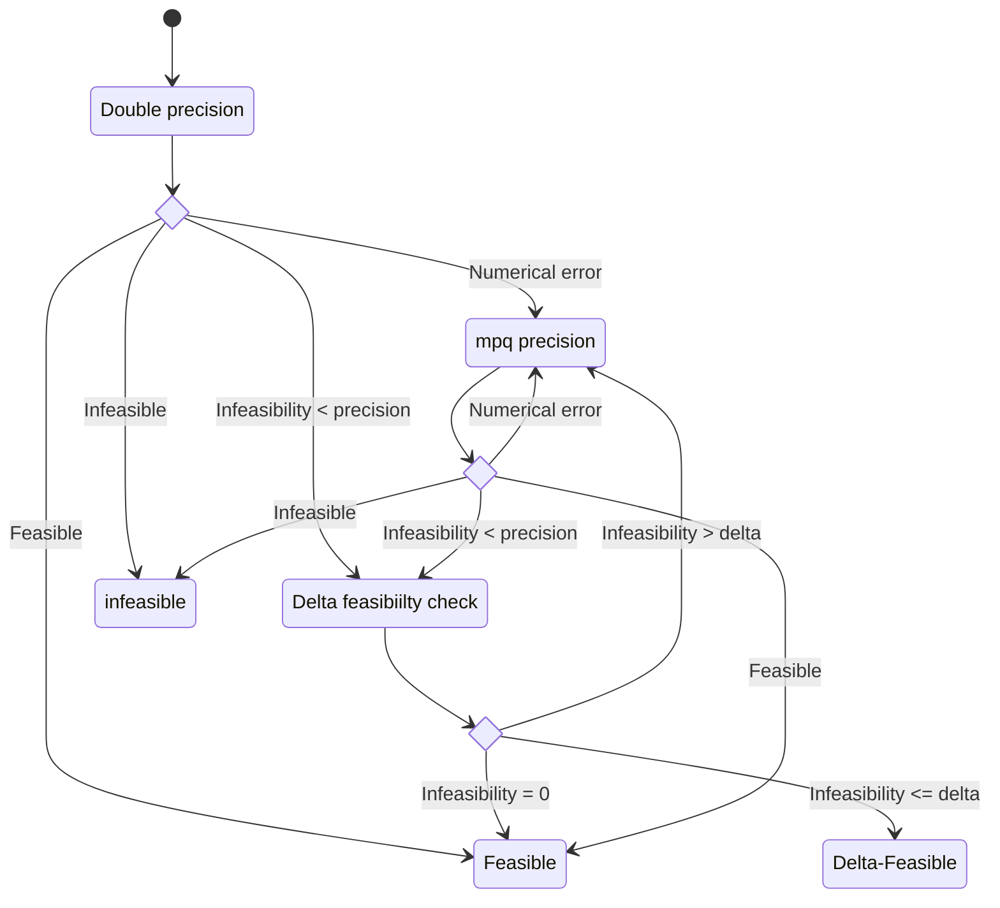

# dLinear - A delta precise SMT solver for linear arithmetic

<!-- New section -->

## Background

- SAT problem
- SMT problem
- Linear programming

<!-- New section -->

### SAT problem

Given a boolean formula, find an assignment to the variables such that the formula is satisfied or produce a proof that no such assignment exists.

While boolean formulas can have arbitrary structure, the most common form used when dealing with them algorithmically is the conjunctive normal form (CNF), a conjunction of clauses, where each clause is a disjunction of literals.  
Any boolean formula can be converted to CNF (Tseytin transformation).

$$
\text{CNF} = \underbrace{(l_{11} \vee l_{12} \vee \dots \vee l_{1m_1})}_{\text{clause}} \wedge (l_{21} \vee l_{22} \vee \dots \vee l_{2m_2}) \wedge \dots \wedge (l_{n1} \vee l_{n2} \vee \dots \vee l_{nm_n}) \\
\text{CNF} = \bigwedge_{i=1}^n \bigvee_{j=1}^{m_i} l_{ij} \\
l_{ij} = x_{ij} \text{ or } \neg x_{ij} \\
x_{ij} = \text{boolean variable}
$$

<!-- New subsection -->

#### Main algorithms

- DPLL (Davis-Putnam-Logemann-Loveland)
- CDCL (Conflict-driven clause learning)
- Local search

<!-- New subsection -->

#### Example

Problem 1

$$
(a \vee \neg b \vee c) \wedge (\neg a \vee c \vee \neg d) \wedge (\neg a \vee \neg b \vee d) \\
\ \\
\begin{cases}
a = \red{0} \\
b = \green{1} \\
c = \green{1} \\
d = \red{0} \\
\end{cases}
$$

Problem 2

$$
(a \vee b) \wedge ( \neg a \vee c) \wedge ( \neg b \vee  \neg c) \wedge ( \neg b \vee c) \wedge ( \neg a \vee  \neg c) \\
\ \\
\text{No assignment exists}
$$

<!-- New section -->

### SMT problem

The SAT problem can be extended to include theories, such as integer arithmetic, bit vectors, floating point numbers, arrays, etc.  
The atoms that make up a boolean formula are replaced by predicates that need to be evaluated following the rules of the theory.

<!-- New subsection -->

#### Approaches

There are two main approaches to solving SMT problems:

- **Eager**: the SAT solver is extended to handle the theory
- **Lazy**: the SAT solver is used as a black box and the theory is handled by a separate solver

<!-- New subsection -->

#### Example

Problem 1

$$
(a \vee b) \wedge ( \neg a \vee c) \\
\ \\
\begin{cases}
a := x \geq 0 \\
b := x < 0 \\
c := x > 10 \\
\end{cases} \\
\ \\
x = 11
$$

Problem 2

$$
(a \vee b) \wedge ( \neg a \vee c) \\
\ \\
\begin{cases}
a := x \le 9 \\
b := x < 0 \\
c := x > 10 \\
\end{cases} \\
\ \\
\text{No assignment exists}
$$

<!-- New section -->

### Linear programming

Linear Programming, also called Linear Optimization, is a method to achieve the best outcome possible on a minimization or maximization linear objective function of several variables under linear equality and inequality constraints.

<!-- New subsection -->

#### Standard form

A way to standardize a linear programming problem is to convert it in its canonical form.
This operation is always possible.
The resulting structure is the following:

$$
\begin{align*}
\text{minimize } \quad & c_1 x_1 + c_2 x_2 + \dots + c_n x_n \\
\text{subject to } \quad & a_{11} x_1 + a_{12} x_2 + \dots + a_{1n} x_n \ge b_1 \\
& a_{21} x_1 + a_{22} x_2 + \dots + a_{2n} x_n \ge b_2 \\
& \dots \\
& a_{m1} x_1 + a_{m2} x_2 + \dots + a_{mn} x_n \ge b_m \\
& x_1 \geq 0, x_2 \geq 0, \dots, x_n \geq 0
\end{align*}
$$

where $x_1, x_2, \dots, x_n$ are the variables we aim to find the value of, $c_1, c_2, \dots, c_n$ are the coefficients of the objective function, $a_{11}, a_{12}, \dots, a_{mn}$ are the coefficients of the constraints, and $b_1, b_2, \dots, b_m$ are the known terms in the constraints.

A more compact way to write the linear programming can be achieved by using matrix notation:

$$
\begin{align*}
\text{minimize } \quad & c^T x \\
\text{subject to } \quad & A x \ge b \\
& \mathbf{x} \geq 0
\end{align*}
$$

<!-- New subsection -->

#### Main algorithms

- Simplex method
- Interior point method

<!-- New subsection -->

#### Example

$$
\begin{align*}
\text{minimize } \quad & 2 x_1 + x_2 \\
\text{subject to } \quad & x_1 + x_2 \ge 4 \\
& -x_1 + 2 x_2 \ge 2 \\
& x_1 \geq 0, x_2 \geq 0
\end{align*}
$$

Solution $x$ = $(0, 4)$  
Objective function value = $4$

<!-- New section -->

## dLinear

dLinear is a delta precise SMT solver for linear arithmetic.  
It is based on the [dReal](https://github.com/dreal/dreal4) SMT Solver for non-linear theories of reals.

<!-- New subsection -->

### Satisfability in linear arithmetic

The satisfability problem in linear arithmetic is the problem of finding if there exists a solution to a system of linear equalities and inequalities.
In its most generic form, it can be expressed as:

$$
\exists x \in \mathbb{Q}^n : Ax \ge b, x \ge 0
$$

Note that the formulation is the same as the one for a linear programming problem, but there is no objective function to minimize or maximize.

The problem can also be rewritten as

$$
\exists x \in \mathbb{Q}^n : Ax = b, x \ge 0
$$

by introducing slack variables.

<!-- New subsection -->

### Delta precision

Delta precision is a technique that allows to find a solution to a problem with an arbitrary perturbation of the constraints, $\delta$.

Given a set of constrains $\phi$ in the form $t \ge 0$ or $t = 0$, where $t$ is an arbitrary term, the delta weakening of $\phi$ for a positive value $\delta$, denoted with $\phi^{-\delta}$ is a set of constraints that substitutes each constraint $t \ge 0$ with $t \ge -\delta$ and each constraint $t = 0$ with $-\delta \le t \le \delta$.

<!-- New subsection -->

#### Delta wakened problem

The original problem, when delta weakened, becomes:

$$
\exists x \in \mathbb{Q}^n : -\delta e_n \le Ax - b \le \delta e_n, x \ge -\delta e_n
$$

where $e_n = \begin{bmatrix} 1, 1, \dots, 1 \end{bmatrix}$ the denotes a vector of ones of size $n$.

<!-- New subsection -->

### Why delta precision?

When dealing with general non linear problems, an approximate solution is to be expected, since the exact operations are often uncomputable, relying instead on numerical methods, with the risk of growing the overapproximation.  
On the contrary, linear problems can be solved exactly using rational arithmetic, but the computational cost of each operation can be very high.
It's woth noting that a complete solution, meanin an exact one, is by definition, trivially delta complete.

The goal is to find if using delta precision can provide a meaningful advantage over the complete method.

<!-- New subsection -->

### Rational arithmetic vs floating point arithmetic

Rational arithmetic deals with numbers that can be expressed as a ratio of two integers.
The de-facto standard library for rational arithmetic in C++ is [GMP](https://gmplib.org/), which is a very efficient implementation, but still slower than floating point arithmetic.

It works by keeping track of the numerator and denominator of the rational number, and performing the operations on them.

### Objectives

- investigate numerically rigorous techniques for solving linear programming problems
- develop algorithms that relax the completeness of these algorithms providing still useful but faster results
- implement the developed algorithms in software

## Qsoptex algorithm

