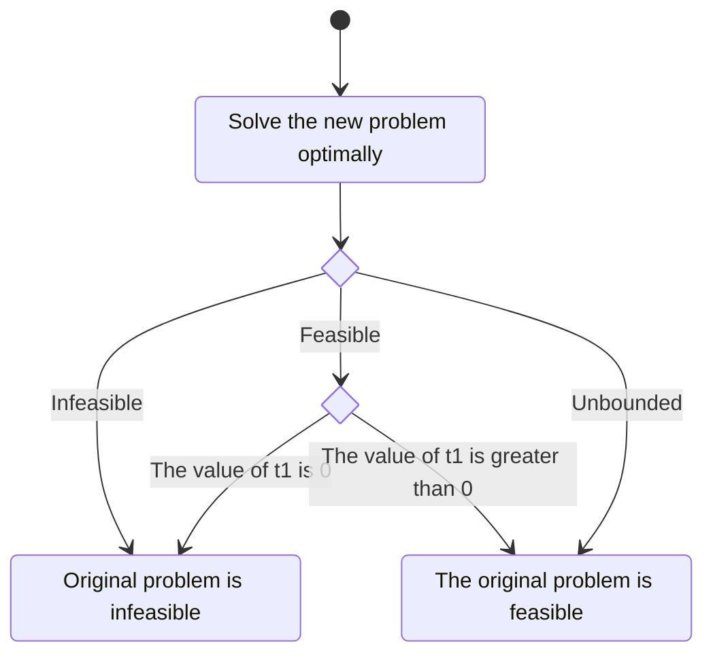

# Strict inequalities in LP solvers

<qrcode width="200" />

<!-- New section -->

## LP problem

Consider the following LP problem:

$$
\begin{array}{lll}
\max \quad & c_1 x_1 + c_2 x_2 + \dots + c_n x_n \newline
\text{s.t.} \quad & a_{11} x_1 + a_{12} x_2 + \dots + a_{1n} x_n \le b_1 \newline
& a_{21} x_1 + a_{22} x_2 + \dots + a_{2n} x_n \le b_2 \newline
& \vdots \newline
& a_{m1} x_1 + a_{m2} x_2 + \dots + a_{mn} x_n \le b_m \newline
& x_i \ge 0, \quad i = 1, 2, \dots, n
\end{array}
$$

with $c_i, a_{ij}, b_j \in \mathbb{R}$ and $i = 1, 2, \dots, n$, $j = 1, 2, \dots, m$.

<!-- New subsection -->

### Feasibility

Since we are only interested in the feasibility of the problem, we can assume that the objective function is a constant, i.e., $0$.

$$
\begin{align*}
\max \quad & 0 \newline
\text{s.t.} \quad & a_{11} x_1 + a_{12} x_2 + \dots + a_{1n} x_n \le b_1 \newline
& a_{21} x_1 + a_{22} x_2 + \dots + a_{2n} x_n \le b_2 \newline
& \vdots \newline
& a_{m1} x_1 + a_{m2} x_2 + \dots + a_{mn} x_n \le b_m \newline
& x_i \ge 0, \quad i = 1, 2, \dots, n
\end{align*}
$$

Solving the problem with an LP solver will give us the feasibility of the problem.

<!-- New section -->

## Strict inequalities

Let's now consider the case where a strict inequality is present.

$$
\begin{align*}
\max \quad & 0 \newline
\text{s.t.} \quad & a_{11} x_1 + a_{12} x_2 + \dots + a_{1n} x_n < b_1 \newline
& \vdots \newline
& x_i \ge 0, \quad i = 1, 2, \dots, n
\end{align*}
$$

<!-- New subsection -->

### How to deal with strict inequalities

Simplex based LP solvers have to either

- use a symbolic delta to the right-hand side of the inequality
  - requires a specialised solver
- add a small real value $\epsilon$ to differentiate the left-hand side from the right-hand side of the inequality
  - adds an arbitrary error to the problem (what if $\epsilon$ is too small?)

<!-- New subsection -->

### Alternative: Problem transformation

Maybe we could leverage the fact that we don't have an objective function and transform the problem in a way that allows us to check for feasibility on a problem with strict inequalities with a standard LP solver.

$$
\begin{array}{ll}
\max \quad & 0 \newline
\text{s.t.} \quad & a_{11} x_1 + a_{12} x_2 + \dots + a_{1n} x_n < b_1 \newline
& \vdots \newline
& x_i \ge 0, \quad i = 1, 2, \dots, n
\end{array}
$$

<!-- .element: class="fragment fade-in-then-out m-unset" -->

$$
\begin{align*}
\max \quad & 0 \newline
\text{s.t.} \quad & a_{11} x_1 + a_{12} x_2 + \dots + a_{1n} x_n + t_1 \le b_1 \newline
& \vdots \newline
& x_i \ge 0, \quad i = 1, 2, \dots, n \newline
& t_1 > 0
\end{align*}
$$

<!-- .element: class="fragment fade-in-then-out m-unset" -->

$$
\begin{align*}
\max \quad & t_1 \newline
\text{s.t.} \quad & a_{11} x_1 + a_{12} x_2 + \dots + a_{1n} x_n + t_1 \le b_1 \newline
& \vdots \newline
& x_i \ge 0, \quad i = 1, 2, \dots, n \newline
& t_1 \ge 0
\end{align*}
$$

<!-- .element: class="fragment fade-in-then-out m-unset" -->

<!-- New subsection -->

### How to read the results

Since we are maximising $t_1$, if the problem is feasible, the solver will return a value of $t_1$ greater than $0$ if the problem allows it.

<!-- New subsection -->

### Avoid unboundedness

Since to verify that a problem is unbounded can be tricky, we can add an arbitrary upper bound to the additional variable $t_1$.

$$
\begin{align*}
\max \quad & t_1 \newline
\text{s.t.} \quad & a_{11} x_1 + a_{12} x_2 + \dots + a_{1n} x_n + t_1 \le b_1 \newline
& \vdots \newline
& x_i \ge 0, \quad i = 1, 2, \dots, n \newline
& 0 \le t_1 \le 1
\end{align*}
$$

<!-- New subsection -->

### Greater than inequalities

$$
\begin{align*}
\max \quad & 0 \newline
\text{s.t.} \quad & a_{11} x_1 + a_{12} x_2 + \dots + a_{1n} x_n > b_1 \newline
& \vdots \newline
& x_i \ge 0, \quad i = 1, 2, \dots, n \newline
\end{align*}
$$

<!-- .element: class="fragment fade-in-then-out m-unset" -->

$$
\begin{align*}
\max \quad & 0 \newline
\text{s.t.} \quad & -a_{11} x_1 - a_{12} x_2 - \dots - a_{1n} x_n < -b_1 \newline
& \vdots \newline
& x_i \ge 0, \quad i = 1, 2, \dots, n \newline
\end{align*}
$$

<!-- .element: class="fragment fade-in-then-out m-unset" -->

$$
\begin{align*}
\max \quad & t_1 \newline
\text{s.t.} \quad & -a_{11} x_1 - a_{12} x_2 - \dots - a_{1n} x_n + t_1 \le -b_1 \newline
& \vdots \newline
& x_i \ge 0, \quad i = 1, 2, \dots, n \newline
& t_1 \ge 0
\end{align*}
$$

<!-- .element: class="fragment fade-in-then-out m-unset" -->

<!-- New subsection -->

### Not equal inequalities(?)

Only a single additional variable is added to the problem.

(boolean variable?)

$$
\begin{align*}
\max \quad & 0 \newline
\text{s.t.} \quad & a_{11} x_1 + a_{12} x_2 + \dots + a_{1n} x_n \ne b_1 \newline
& \vdots \newline
& x_i \ge 0, \quad i = 1, 2, \dots, n \newline
\end{align*}
$$

<!-- .element: class="fragment fade-in-then-out m-unset" -->

$$
\begin{align*}
\max \quad & 0 \newline
\text{s.t.} \quad & a_{11} x_1 + a_{12} x_2 + \dots + a_{1n} x_n - b_1 \ne 0 \newline
& \vdots \newline
& x_i \ge 0, \quad i = 1, 2, \dots, n \newline
\end{align*}
$$

<!-- .element: class="fragment fade-in-then-out m-unset" -->

$$
\begin{align*}
\max \quad & 0 \newline
\text{s.t.} \quad & |a_{11} x_1 + a_{12} x_2 + \dots + a_{1n} x_n - b_1| \gt 0 \newline
& \vdots \newline
& x_i \ge 0, \quad i = 1, 2, \dots, n \newline
\end{align*}
$$

<!-- .element: class="fragment fade-in-then-out m-unset" -->

<!-- New subsection -->

### Multiple strict inequalities

If the problem has a solution, the value of $t_1$ will be the smallest $\epsilon$ that keeps the problem feasible or $0$ if at least one constraint is violated.

$$
\begin{align*}
\max \quad & 0 \newline
\text{s.t.} \quad & a_{11} x_1 + a_{12} x_2 + \dots + a_{1n} x_n < b_1 \newline
& a_{21} x_1 + a_{22} x_2 + \dots + a_{2n} x_n < b_2\newline
& \vdots \newline
& x_i \ge 0, \quad i = 1, 2, \dots, n \newline
\end{align*}
$$

<!-- .element: class="fragment fade-in-then-out m-unset" -->

$$
\begin{align*}
\max \quad & t_1 \newline
\text{s.t.} \quad & a_{11} x_1 + a_{12} x_2 + \dots + a_{1n} x_n + t_1 \le b_1 \newline
& a_{21} x_1 + a_{22} x_2 + \dots + a_{2n} x_n + t_1 \le b_2\newline
& \vdots \newline
& x_i \ge 0, \quad i = 1, 2, \dots, n \newline
& t_1 \ge 0
\end{align*}
$$

<!-- .element: class="fragment fade-in-then-out m-unset" -->

<!-- New section -->

## Efficiency

$j$ additional variables hare added to the problem, where $j$ is the number of strict inequalities, along with $j$ additional constraints to avoid unboundedness.
Finally we are making the objective function non-trivial.
